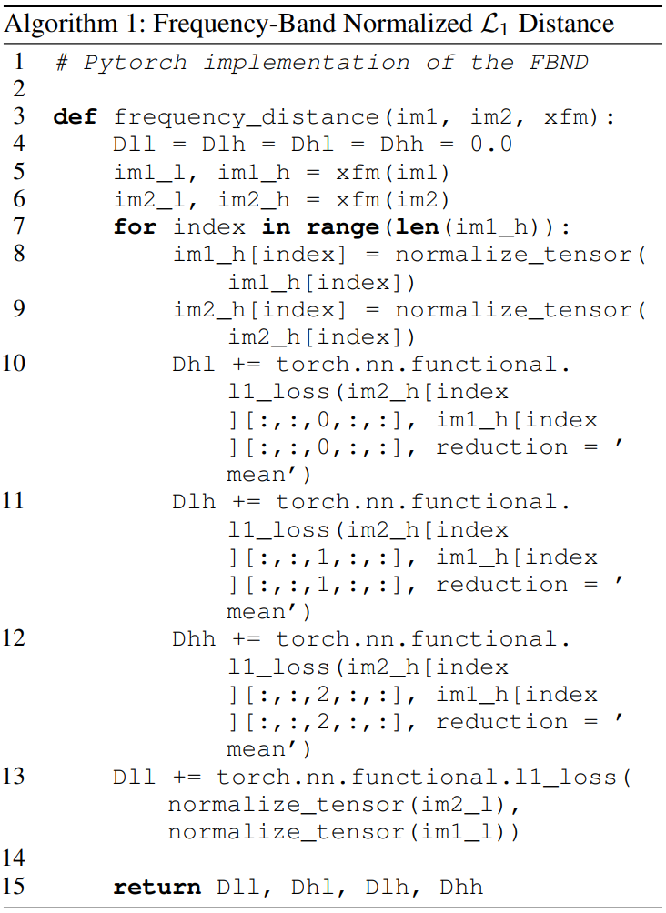
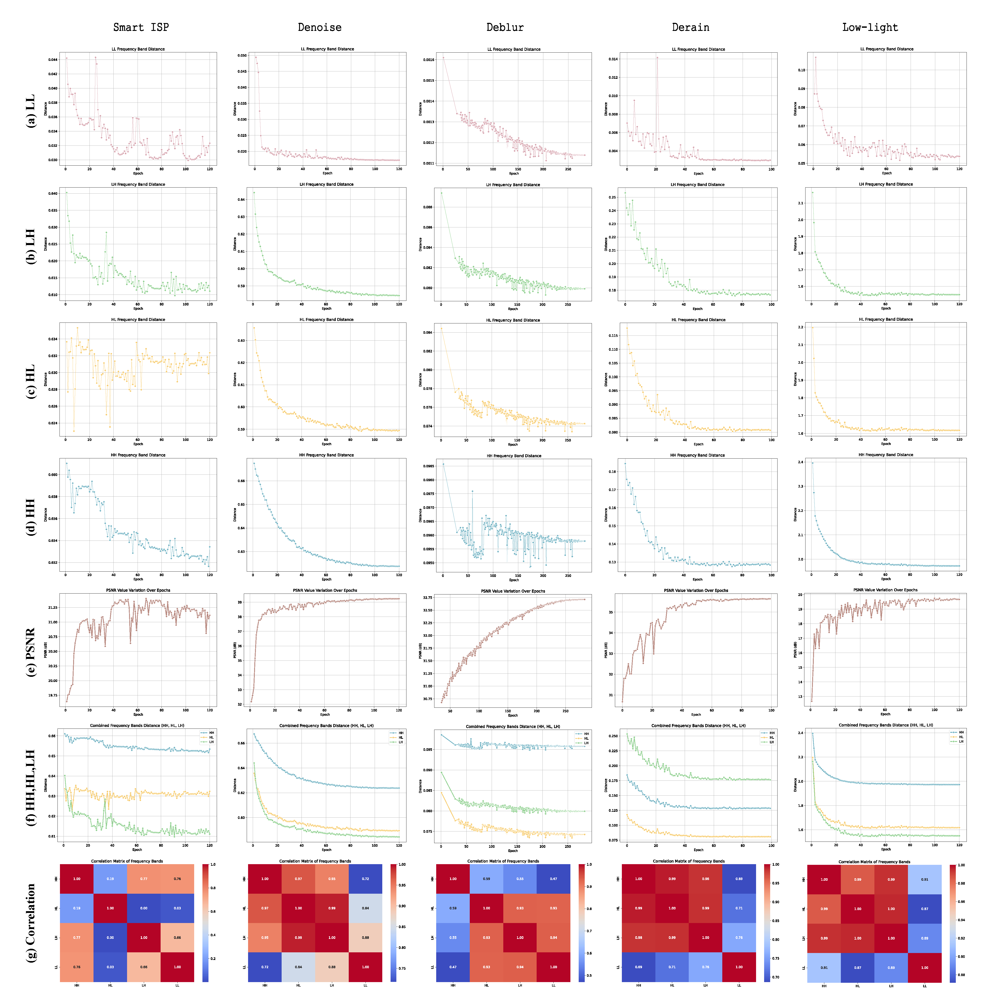
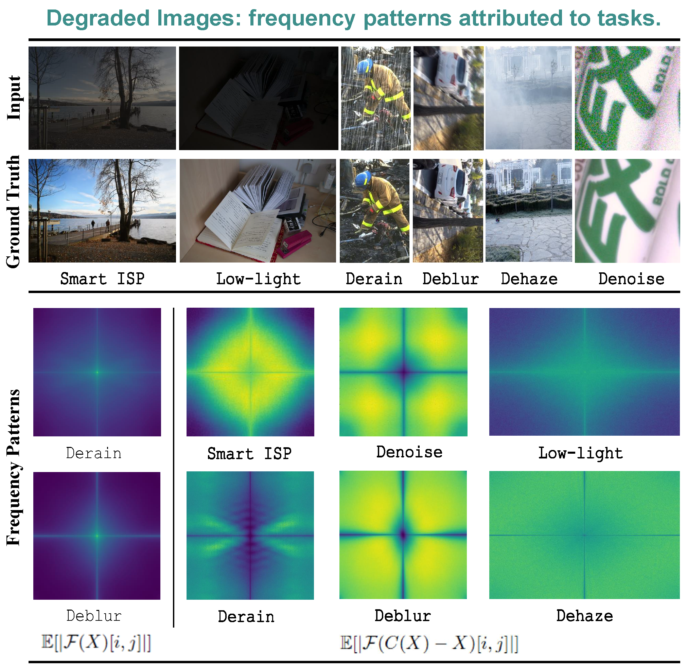

# CutFreq
This repository contains the implementation of the *CutFreq*. The code was developed and tested on `Ubuntu 16.04`, with `PyTorch` `CUDA 10.2` installed.

## Preliminary Analysis

### 1. Frequency-Band Normalized $\mathcal{L}_1$ Distance (FBND) 
We propose the frequency-band normalized $\mathcal{L}_1$ distance (FBND) to measure model convergence for different frequency components. The implemented pseudocode is as follows.

$\mathcal{{FBND}}=\frac{1}{{n}} \sum_{i}^{n}\left\|\Psi^{t} \circ f\left(x_{i}\right)-\Psi^{t} \circ J\left(x_{i}\right)\right\|_{1}, t \in LL,HL,LH,HH.$

{:height="50%" width="50%"}

Trend of frequency convergence for reconstruction models across various task datasets.


### 2. Frequency patterns of different tasks

Compute frequency patterns for reconstruction tasks, replacing own real dataset paths in `IMAGES_PATH`.
```shell
python analysis/freq-pattern.py
```
Compare the frequency difference between the degraded image and the real image, and replace `IMAGES_PATH` with your own test sample.
```shell
python analysis/freq-gen.py
```
{:height="70%" width="70%"}


## CutFreq Algorithm
The data augmentation methods involved in the paper can be found in `dataset_utils.py`.

### 1. Quick Start

#### (a) Installation
Install [pytorch_wavelets](https://github.com/fbcotter/pytorch_wavelets) to perform wavelet transform as well as inverse wavelet transform.
```shell
cd pytorch_wavelets
pip install .
```
The requirements.txt file is also provided, and all packages will be installed using:
```shell
pip install -r requirements.txt
```

#### (b) Usage
After loading the training samples, CutFreq data enhancement can be performed:
```shell
if epoch <= 60:
    target, input_aug, mask, aug = dataset_utils.apply_augment(target, input_, xfm1, ifm1, augs=["CutFreq_StageI", "none"], mix_p=[0.5,0.5], component=-1)
    if aug == "CutFreq_StageI":
        input_ = 0.2 * input_aug + (1 - 0.2) * input_
    else:
        input_ = input_aug
else:
    target, input_aug, mask, aug = dataset_utils.apply_augment(target, input_, xfm1, ifm1, augs=["CutFreq_StageII", "CutFreq_StageI", "none"], mix_p=[0.4,0.4,0.2], component=-1)
    if aug == "CutFreq_StageI":
        input_ = 0.2 * input_aug + (1 - 0.2) * input_
    else:
        input_ = input_aug
```


#### (c) Training
To implement the CutFreq on LoL (Low-light Image Enhancement) dataset, run:
```shell
python train.py
```

#### (d) Evaluation
To validate the model, run:
```shell
python test_enhancement.py
```

### 2. Custom Your Own Strategy
For our CutFreq, there are hyper-parameters may affect the final performance:
* swap policy
* segment parameter
* augment probability
* combing parameter

For your own dataset (task) and models, we recommend the following steps to access a better performance:
<ol>
<li> Preliminary analysis on your own training process. </li>
<li> Select a swap policy according to our observations.</li>
<li> Adjust parameters for optimal results.</li>
</ol>

## Visualization
Compare the frequency differences (histogram) between the reconstructed image and the real image.
```shell
python analysis/freq-quantize.py
```

## Acknowledgement
This code is grounded on [PyNET](https://github.com/aiff22/PyNET-PyTorch), and our work also uses [Restormer](https://github.com/swz30/Restormer/tree/main) and [HINet](https://github.com/megvii-model/HINet). Thanks to all.

## License
`CutFreq` is released under the MIT License. See the [LICENSE](./LICENSE) file for more details.